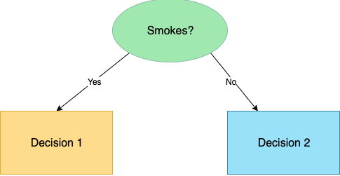
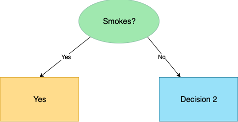

# COMP 9318 Assignment 1
<p align="right">Jiahui Wang(z5274762)</p>

----
## Question 1
### 1. Complete data cube of R.
| Location | Time | Item | SUM(Quantity)|
| ------ | ------ | ------ | ------ |
| Sydney |  2005 | PS2 | 1400 |
| Sydney |  2005 | ALL | 1400 |
| Sydney |  2006 | PS2 | 1500 |
| Sydney |  2006 | Wii | 500 |
| Sydney |  2006 | ALL | 2000 |
| Sydney |  ALL | PS2 | 2900 |
| Sydney |  ALL | Wii | 500 |
| Sydney |  ALL | ALL | 3400 |
| Melbourne |  2005 | XBox 360 | 1700 |
| Melbourne |  2005 | ALL | 1700 |
| Melbourne |  ALL | XBox 360 | 1700 |
| Melbourne |  ALL | ALL | 1700 |
| ALL |  2005 | PS2 | 1400 |
| ALL |  2006 | PS2 | 1500 |
| ALL |  2006 | Wii | 500 |
| ALL |  2005 | XBox 360 | 1700 |
| ALL |  2005 | ALL | 3100 |
| ALL |  2006 | ALL | 2000 |
| ALL |  ALL | PS2 | 2900 |
| ALL |  ALL | Wii | 500 |
| ALL |  ALL | XBox 360 | 1700 |
| ALL |  ALL | ALL | 5100 |

### 2. SQL statement that computes the same result.
```sql
SELECT Location, Time, Item, SUM(Quatity)
FROM R
GROUP BY Location, Time, Item
UNION ALL
SELECT Location, Time, ALL, SUM(Quatity)
FROM R
GROUP BY Location, Time
UNION ALL
SELECT Location, ALL, Item, SUM(Quatity)
FROM R
GROUP BY Location, Item
UNION ALL
SELECT ALL, Time, Item, SUM(Quatity)
FROM R
GROUP BY Time, Item
UNION ALL
SELECT ALL, ALL, Item, SUM(Quatity)
FROM R
GROUP BY  Item
UNION ALL
SELECT ALL, Time, ALL, SUM(Quatity)
FROM R
GROUP BY Time
UNION ALL
SELECT Location, ALL, ALL, SUM(Quatity)
FROM R
GROUP BY Location
UNION ALL
SELECT ALL, ALL, ALL, SUM(Quatity)
FROM R
```

### 3. The result of the query in a tabular form.
| Location | Time | Item | SUM(Quantity)|
| ------ | ------ | ------ | ------ |
| Sydney |  2006 | ALL | 2000 |
| Sydney |  ALL | PS2 | 2900 |
| ALL |  2005 | ALL | 3100 |
| ALL |  2006 | ALL | 2000 |
| ALL |  ALL | PS2 | 2900 |
| Sydney |  ALL | ALL | 3400 |
| ALL |  ALL | ALL | 5100 |

### 4. MOLAP cube

- $ f(x)=9 \cdot f_{Location}(x) + 3 \cdot f_{Time}(x) + f_{Item}(x)$:

| Location | Time | Item | SUM(Quantity)| f(x) as ArrayIndex|
| ------ | ------ | ------ | ------ | ------|
| 1 |  1 | 1 | 1400 | 13|
| 1 |  1 | 0 | 1400 | 12|
| 1 |  2 | 1 | 1500 | 16|
| 1 |  2 | 3 | 500 |  18|
| 1 |  2 | 0 | 2000 | 15|
| 1 |  0 | 1 | 2900 | 10|
| 1 |  0 | 3 | 500 |  12|
| 1 |  0 | 0 | 3400 | 9|
| 2 |  1 | 2 | 1700 | 23|
| 2 |  1 | 0 | 1700 | 21|
| 2 |  0 | 2 | 1700 | 20|
| 2 |  0 | 0 | 1700 | 18|
| 0 |  1 | 1 | 1400 | 4|
| 0 |  2 | 1 | 1500 | 7|
| 0 |  2 | 3 | 500 |  9|
| 0 |  1 | 2 | 1700 | 5|
| 0 |  1 | 0 | 3100 | 3|
| 0 |  2 | 0 | 2000 | 6|
| 0 |  0 | 1 | 2900 | 1|
| 0 |  0 | 3 | 500 |  3|
| 0 |  0 | 2 | 1700 | 2|
| 0 |  0 | 0 | 5100 | 0|

- $ f(x)=16 \cdot f_{Location}(x) + 4 \cdot f_{Time}(x) + f_{Item}(x)$:

| Location | Time | Item | SUM(Quantity)| f(x) as ArrayIndex|
| ------ | ------ | ------ | ------ | ------|
| 1 |  1 | 1 | 1400 | 21|
| 1 |  1 | 0 | 1400 | 20|
| 1 |  2 | 1 | 1500 | 25|
| 1 |  2 | 3 | 500 |  27|
| 1 |  2 | 0 | 2000 | 24|
| 1 |  0 | 1 | 2900 | 17|
| 1 |  0 | 3 | 500 |  19|
| 1 |  0 | 0 | 3400 | 16|
| 2 |  1 | 2 | 1700 | 38|
| 2 |  1 | 0 | 1700 | 36|
| 2 |  0 | 2 | 1700 | 34|
| 2 |  0 | 0 | 1700 | 32|
| 0 |  1 | 1 | 1400 | 5|
| 0 |  2 | 1 | 1500 | 9|
| 0 |  2 | 3 | 500 |  11|
| 0 |  1 | 2 | 1700 | 6|
| 0 |  1 | 0 | 3100 | 4|
| 0 |  2 | 0 | 2000 | 8|
| 0 |  0 | 1 | 2900 | 1|
| 0 |  0 | 3 | 500 |  3|
| 0 |  0 | 2 | 1700 | 2|
| 0 |  0 | 0 | 5100 | 0|

- We should choose $ f(x)=16 \cdot f_{Location}(x) + 4 \cdot f_{Time}(x) + f_{Item}(x)$.
- Because the ArrayIndex should not be repeated, or we can not recover Location, Time, Item values by ArrayIndex. $ f(x)=9 \cdot f_{Location}(x) + 3 \cdot f_{Time}(x) + f_{Item}(x)$ has repeat ArrayIndex 3, 12 and 18.
- Result MOLAP cube:

| f(x) as ArrayIndex | SUM(Quantity)|
| ------ | ------ |
| 21 | 1400 |
| 20 | 1400 |
| 25 | 1500 |
| 27 | 500 |
| 24 | 2000 |
| 17 | 2900 |
| 19 | 500 |
| 16 | 3400 |
| 38 | 1700 |
| 36 | 1700 |
| 34 | 1700 |
| 32 | 1700 |
| 5 |  1400 |
| 9 |  1500 |
| 11 | 500 |
| 6 |  1700 |
| 4 |  3100 |
| 8 |  2000 |
| 1 |  2900 |
| 3 |  500 |
| 2 |  1700 |
| 0 |  5100 |

## Question 2

### (1) Construct a decision tree using Gini index


#### Step 1. Consider 4 features: Gender, Smokes, Chest pain, Cough, compute Gini index index

- Gender:

| Gender \ Lung Cancer | Yes| No |
| ------ | ------ | ------ |
| Female | 1 | 1 |
| Male | 3 | 1 |

$$ Gini(Gender) = \frac{2}{6} * Gini(1,1) + \frac{4}{6} * Gini(3,1) = 0.42$$

- Smokes:

| Smokes \ Lung Cancer | Yes| No |
| ------ | ------ | ------ |
| Yes | 3 | 0 |
| No | 1 | 2 |

$$ Gini(Smokes) = \frac{3}{6} * Gini(3,0) + \frac{3}{6} * Gini(1,2) = 0.22$$

- Chest pain:

| Chest pain \ Lung Cancer | Yes| No |
| ------ | ------ | ------ |
| Yes | 2 | 2 |
| No | 2 | 0 |

$$ Gini(Chest pain) = \frac{4}{6}*Gini(2,2)+\frac{2}{6} * Gini(2,0) = 0.33$$

- Cough:

| Cough \ Lung Cancer | Yes| No |
| ------ | ------ | ------ |
| Yes | 2 | 2 |
| No | 2 | 0 |

$$ Gini(Cough) = \frac{4}{6} * Gini(2,2) + \frac{2}{6} * Gini(2,0) = 0.33$$

<b>So the step 1 Gini result shows as following</b>

| Feature | Gini index |
| ------ | ------ |
| Gender | 0.42 |
| Smokes | 0.22 |
| Chest pain| 0.33|
| Cough | 0.33|

<b>From the table above, Smokes which provides the smallest Gini index choose to split the node, Now after step 1 the decision shows below:</b>



#### Step 2. Consider Smokes=Yes

extract *Smokes=Yes* from original dataset

| Patient ID | Gender| Smokes | Chest pain| Cough|Lung Cancer|
| ------ | ------ | ------ | ------ | ------ | ------ |
| 1 | Female | Yes | Yes | Yes | Yes|
| 2 | Male | Yes | No | Yes | Yes|
| 5 | Male | Yes | Yes | No | Yes|

- All Lung cancer are <b>Yes</b>
- After stpe 2 the decision tree shows below:



#### Step 2. Consider Smokes=No

extract *Smokes=No* from original dataset

| Patient ID | Gender| Smokes | Chest pain| Cough|Lung Cancer|
| ------ | ------ | ------ | ------ | ------ | ------ |
| 3 | Male | No | No | No | Yes|
| 4 | Female | No | Yes | Yes | No|
| 6 | Male | No | Yes | Yes | No|

Consider 3 features: Gender, Chest pain, Cough, compute Gini index index

- Gender:

| Gender \ Lung Cancer | Yes| No |
| ------ | ------ | ------ |
| Female | 0 | 1 |
| Male | 1 | 1 |

$$ Gini(Gender) = \frac{1}{3} * Gini(0,1) + \frac{2}{3} * Gini(1,1) = 0.33$$

- Chest pain:

| Chest pain \ Lung Cancer | Yes| No |
| ------ | ------ | ------ |
| Yes | 0 | 2 |
| No | 1 | 0 |

$$ Gini(Chest pain) = \frac{2}{3} * Gini(0,2) + \frac{1}{3} * Gini(1,0) = 0$$

- Cough:

| Cough \ Lung Cancer | Yes| No |
| ------ | ------ | ------ |
| Yes | 0 | 2 |
| No | 1 | 0 |

$$ Gini(Cough) = \frac{2}{3} * Gini(0,2) + \frac{1}{3} * Gini(1,0) = 0$$

<b>So the step 1 Gini result shows as following</b>

| Feature | Gini index |
| ------ | ------ |
| Gender | 0.33 |
| Chest pain| 0|
| Cough | 0|

<b>From the table above, Chest pain or cough which provide the smallest Gini index choose to split the node, Now after step 3 the decision shows below:</b>


#### Final decision tree


### (2) Translate decision tree into decision rules.

```md
IF Smokes='Yes' THEN Lung Cancer = 'Yes'

IF Smokes='No' AND (Chest pain='No' or Cough='No') THEN Lung Cancer = 'Yes'

IF Smokes='No' AND (Chest pain='Yes' or Cough='Yes') THEN Lung Cancer = 'No'
```

## Question 3

### (1)